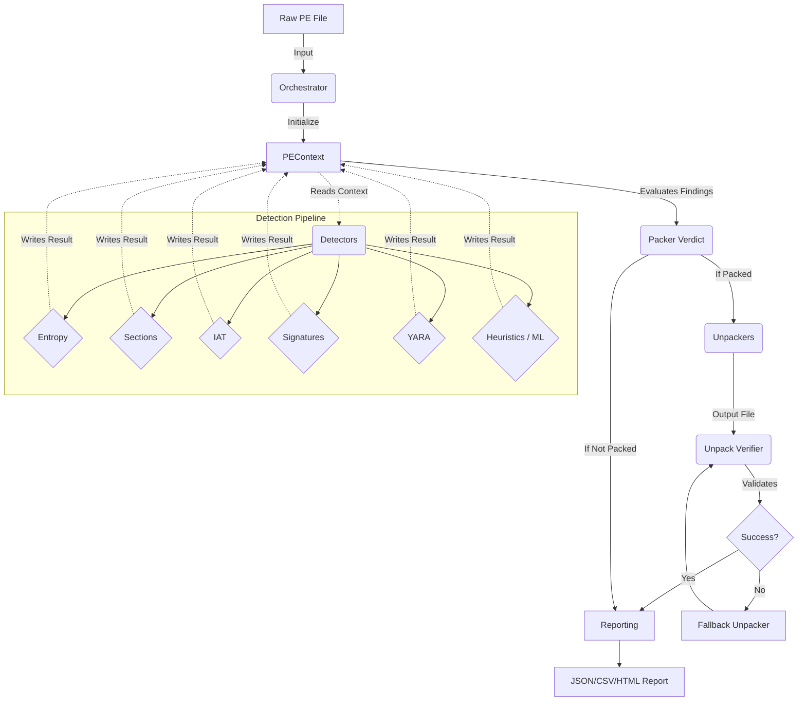
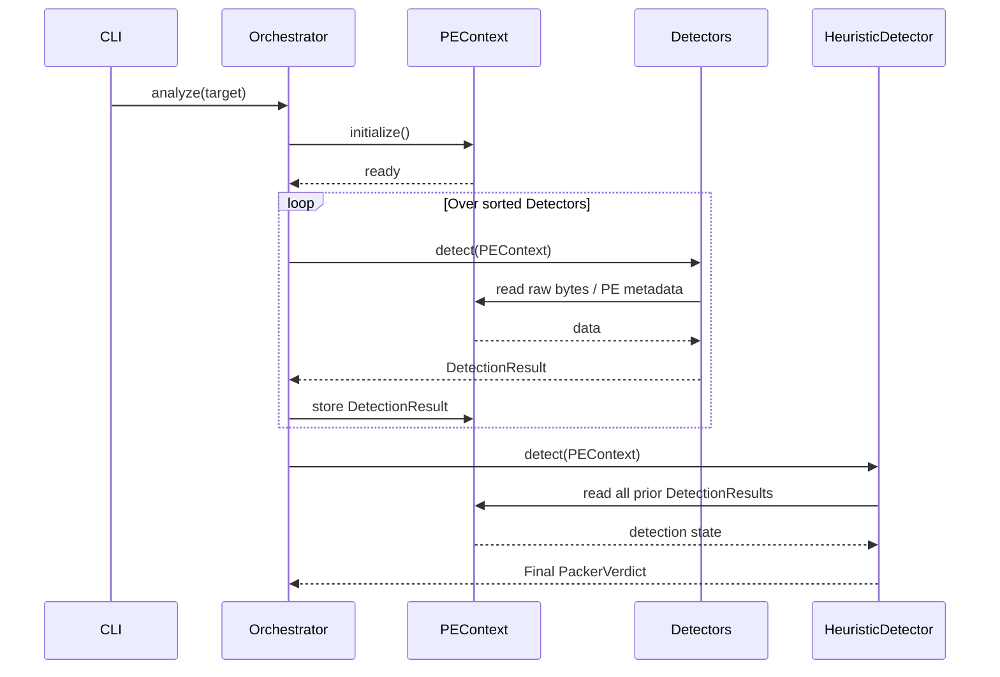
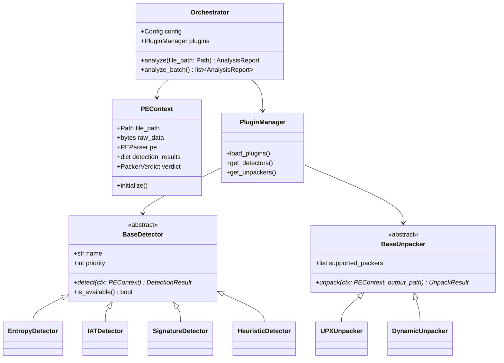

# PackerScope Architecture & Design Document

This document provides comprehensive documentation of the PackerScope framework architecture, data flows, module responsibilities, class designs, and design decisions.

## 1. High-Level Architecture & Plugin System

PackerScope utilizes a **Blackboard architectural pattern** combined with a robust **Strategy/Plugin pattern**. 

* **Blackboard (`PEContext`):** The central state object. Parsed PE data, raw file bytes, and incrementally generated analysis results are posted to this shared context. 
* **Knowledge Sources (Plugins):** Detectors, Unpackers, and Reporters act as independent knowledge sources. They read from the context and write their findings back to it.
* **Controller (`Orchestrator`):** Manages the execution pipeline, invoking plugins in priority order.

### Plugin Architecture
All extension points (Detectors, Unpackers, Reporters) inherit from core abstract base classes defined in `packerscope.core.interfaces`.
The `PluginManager` dynamically discovers these plugins by traversing builtin directories, looking for external custom directories, and reading Python entrypoints.

## 2. Module Responsibilities

| Module / Package | Responsibility |
| :--- | :--- |
| `packerscope.core` | Contains abstract base classes (`interfaces.py`), enumerations (`enums.py`), and strongly-typed data structures (`models.py`) built with Pydantic v2. |
| `packerscope.orchestrator` | Central execution engine. Handles the flow: initialization -> detection -> verification -> unpacking -> reporting. |
| `packerscope.context` | Defines `PEContext`. Encapsulates `pefile.PE`, file bytes, and caches all intermediate analysis results. |
| `packerscope.detectors` | Concrete implementations of `BaseDetector`. E.g., `EntropyDetector`, `IATDetector`, `EntryPointDetector`, `SignatureDetector`, `YARADetector`. |
| `packerscope.unpackers` | Implementations of `BaseUnpacker` covering native tools (`UPXUnpacker`), generic templates, and dynamic emulation hooks. |
| `packerscope.verification` | Validates unpacked output against the original context to confirm success (e.g., verifying entropy reduction, section restoration). |
| `packerscope.reporters` | Implementations of `BaseReporter` generating output formats (JSON, CSV, Markdown, HTML). |
| `packerscope.ml` | Optional machine learning modules (Random Forest, XGBoost) for classifying feature vectors extracted from `HeuristicDetector`. |

## 3. Data Flow Diagram

## 4. Sequence Diagram: Detection Pipeline

## 5. UML Class Diagram

## 6. Design Decisions & Trade-offs

1. **`pefile` Abstraction:** Parsing malformed/packed PE files with `pefile` can lead to uncaught exceptions. To mitigate this, `pefile.PE` is wrapped inside a safe `PEParser` utility class. The design trades minor performance overhead for total stability during batch scanning.
2. **Strategy Pattern for Heuristics:** Instead of a massive conditional block determining the packer type, individual detectors provide focused metrics (e.g., Section anomalies, Entropy classes). The final `HeuristicDetector` aggregates these weighted metrics. This allows for simple threshold tuning via configuration.
3. **Pydantic Models:** Using Pydantic for all data models (e.g., `DetectionResult`, `PackerVerdict`) enforces strict typing, runtime validation, and out-of-the-box JSON serialization. This greatly simplified the development of the reporting subsystem.
4. **Machine Learning Opt-in:** Dependencies like `scikit-learn` and `xgboost` are heavy. ML detection is completely decoupled and configured as an optional `extras` installation. The pipeline degrades gracefully if ML libraries are missing.

## 7. Recommended Python Libraries & Justification

| Library | Version | Purpose & Justification |
| :--- | :--- | :--- |
| `pefile` | `>=2024.8.26` | Industry standard for PE structure parsing. Well-tested against packed samples. |
| `pydantic` | `>=2.9` | State-of-the-art data validation. Defines strict models for all pipeline data exchanges. |
| `capstone` | `>=5.0` | Lightweight, fast disassembly framework. Used for inspecting entry point opcodes. |
| `structlog` | `>=24.4` | Structured JSON logging. Critical for ingesting logs into SIEMs/ELK stacks in an analysis lab. |
| `rich` | `>=13.9` | Advanced terminal rendering. Makes the CLI tool highly readable with colorized tables and progress bars. |
| `yara-python` | `>=4.5` | Standard pattern matching engine for malware researchers. |
| `scikit-learn`/`xgboost` | `>=1.5` | Optional ML dependencies for training Random Forest / XGBoost models on extracted PE features. |

## 8. Testing Strategy

- **Unit Tests (`tests/unit/`):** Comprehensive testing of isolated functions. Mock objects simulate `PEContext` and PE headers to validate detector logic (e.g., verifying that a single section named `UPX0` with high entropy triggers the `SectionDetector`). Tests ensure configuration overrides and enum conversions are sound.
- **Integration Tests (`tests/integration/`):** Verifies the entire pipeline. Tests spawn the `Orchestrator` against generated, valid dummy PE binaries to ensure all plugins run in the correct priority, safely handle parsing, and generate valid reports.

## 9. Future Roadmap & Milestones

### Milestone A: Core Optimization
- Implement multi-processing for the `analyze_batch` command to bypass the Python GIL during heavy Capstone disassembly.
- Add robust `lief` fallback parsing for heavily mutated PE files that break `pefile`.

### Milestone B: Advanced Unpackers
- Integrate the `Qiling` framework to implement full CPU emulation in `DynamicUnpacker`.
- Integrate `Frida` hooks to dump process memory dynamically when standard VirtualAlloc unpacking techniques are identified.

### Milestone C: Machine Learning Expansion
- Deploy pre-trained model binaries (`packer_xgboost.joblib`) out-of-the-box.
- Expand `FeatureExtractor` to calculate CFG (Control Flow Graph) complexity metrics.

### Milestone D: Community Threat Intel
- Fetch updated YARA rules from GitHub threat intel repositories.
- Add support for UnpacMe API submissions.
